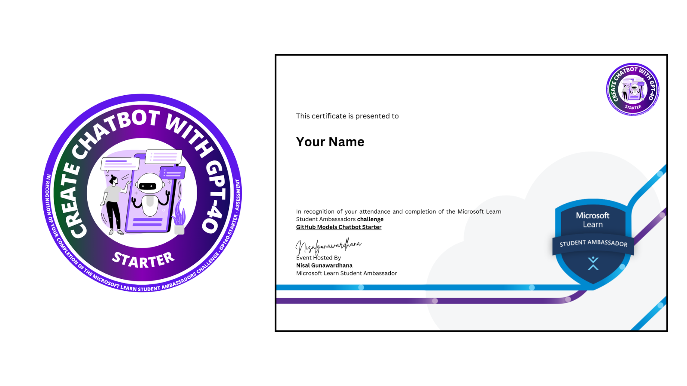

# GitHub Models Chatbot Starter

This repository provides a comprehensive starter kit for leveraging GitHub's GPT-4o AI models with Node.js. Designed for developers, students, and educators, it showcases practical examples for building intelligent chatbots, handling multi-turn conversations, streaming AI responses, processing images, and integrating advanced reasoning capabilities. With step-by-step setup instructions and real-world coding tasks, this project helps you quickly integrate state-of-the-art AI into your applications. Ideal for those seeking to learn, experiment, or build production-ready solutions using GitHub's AI inference API and the latest GPT-4o technology.

[](https://github.com/nisalgunawardhana)


- **Basic Chat Completion**
- **Multi-turn Conversation**
- **Streaming Responses**
- **Image Input Handling**
- **Function/Tool Calling**
- **Reasoning Models** (Complex problem solving and logical reasoning)

## Prerequisites

- Node.js installed on your system.If you don't have Node.js installed, follow the [official Node.js installation guide](https://nodejs.org/en/download/) for your operating system. You can download the installer for Windows, macOS, or Linux, or use a package manager as described in the documentation.

- A valid GitHub token with access to the inference endpoint.

## Setup

1. Fork the repository by visiting it on GitHub and clicking "Fork" to add it to your account.

2. Clone your forked repository and create a new branch named `submission`:
```bash
git clone https://github.com/your-username/github-models-chatbot-starter.git
cd github-models-chatbot-starter
git checkout -b submission
```

3. Set up environment variables by creating a `.env` file in the root directory:
```bash
cp .env.sample .env
```
Add your GitHub token to the `.env` file:
```env
GITHUB_TOKEN=your_github_token_here
```
Make sure `.env` is included in `.gitignore`.

4. Install dependencies by running:
```bash
npm install
```
## Running the Examples

The following examples demonstrate how to interact with the GPT-4o model using different features. Each script showcases a specific capability, such as basic chat, multi-turn conversations, streaming responses, image input, function/tool calling, and advanced reasoning(with o1-priview model). Run each file as described to see how the model responds to various types of input and tasks.

### Basic Chat Completion
Run the `sample-basic.js` file:
```bash
node sample-basic.js
```

### Multi-turn Conversation
Run the `sample-multiturn.js` file:
```bash
node sample-multiturn.js
```

### Streaming Responses
Run the `sample-stream.js` file:
```bash
node sample-stream.js
```

### Image Input Handling
Update the `imagePath` in `sample-image.js` to point to your image file, then run:
```bash
node sample-image.js
```

### Function/Tool Calling
Run the `sample-tools.js` file:
```bash
node sample-tools.js
```

### Reasoning Models
Run the `sample-reasoning.js` file to see complex reasoning and problem-solving capabilities:
```bash
node sample-reasoning.js
```

This example demonstrates:
- Mathematical reasoning
- Logic puzzles
- Complex problem solving
- Ethical reasoning scenarios

---
## Assessment Task: Multi-turn Coding Assistant Chatbot

Showcase your achievement on LinkedIn, GitHub, or your portfolio to impress future employers and peers!

You are required to build a multi-turn chatbot that provides coding assistance using the GPT-4o model via GitHub's AI inference API. Your chatbot should maintain conversation context, offer meaningful programming help, and support multiple languages and coding scenarios.

### What to Do

1. **Environment Setup**
  - Use the `dotenv` package to load environment variables.
  - Add your GitHub token to a `.env` file as `GITHUB_TOKEN`.
  - Ensure your `.env` is listed in `.gitignore`.

2. **API Initialization**
  - Use the `openai` npm package.
  - Configure the API client to use your GitHub token and the GitHub models endpoint.

3. **Conversation Logic**
  - Implement a loop that lets the user and bot exchange messages.
  - Store the conversation history so the chatbot remembers previous messages.
  - Allow the user to exit the chat gracefully (e.g., by typing `exit`).

4. **Coding Assistance Features**
  - Respond to user questions about programming concepts, code examples, debugging, and best practices.
  - Support multiple programming languages.
  - Provide clear, helpful, and accurate responses.

5. **Error Handling**
  - Handle API errors and invalid inputs gracefully.

### Example

- User: "How do I create a function in JavaScript?"
- Bot: "You can use the `function` keyword or an arrow function. For example: `function greet() { console.log('Hello'); }`"

- User: "Can you help me debug this code?"
- Bot: "Sure! Please share your code and describe the issue."

### Where to Implement

- Write your solution in the `assessment.js` file in this repository.

**Complete the assessment as described below to earn your certificate and badge!**

Once you have finished implementing your multi-turn coding assistant chatbot in `assessment.js` and submitted your pull request, you will be eligible to receive an official certificate and badge from MLSA.

> 

**How to claim your certificate and badge:**
1. Complete all steps in the "Assessment Task" section.
2. Submit your pull request and create an issue as instructed.
3. After your submission is reviewed and approved, you will receive your personalized certificate and badge via email.

### Submission

- Follow the instructions below to commit your code, push your branch, and create a pull request for review.


6. **Make a Pull Request**
   - Push your changes:
     ```bash
     git add .
     git commit -m "Complete assessment"
     git push origin submission
     ```
   - Create a pull request from your `submission` branch to the `submission-reviewer` branch on the main repository.

   
   

    Follow the above images for a visual guide on creating a pull request.

   **Tip:** After creating your pull request, copy the PR link from your browser's address bar. You will need this link when creating your submission issue in the next step.

7. **Create an Issue**
   - Go to the main repository and create an issue using the `submission` template.
   - Fill in the following details:
     - Full Name
     - University
     - Pull Request Link

8. **Review and Certification**
   - Once your submission is reviewed and approved, you will receive a badge and certificate.

## Notes

- Replace `your_github_token_here` in the `.env` file with your actual GitHub token.
- For the image input example, ensure the image file exists at the specified path.

---

## How to Get a GitHub Token (Developer Key)

To use these demos, you need a GitHub personal access token with the `models:read` permission.

### Steps to create a token:
1. Go to [GitHub Settings > Developer settings > Personal access tokens](https://github.com/settings/tokens)
2. Click **"Generate new token"** (classic or fine-grained)
3. Give your token a name and select an expiration date
4. Under **"Select scopes"**, check `models:read`
5. Click **"Generate token"** and copy the token (you won't be able to see it again)

### Video Walkthrough

[](../Images/demo_token_video.mp4)

Watch this short video for a step-by-step guide on generating your GitHub personal access token.

**Keep your token secure and do not share it publicly.**

---

## Other Resources

- [Github Models Demo](https://github.com/nisalgunawardhana/Github-Models-Demo)
- [Introduction to Github Models](https://github.com/nisalgunawardhana/Introduction-to-Github-models)

### Learn About MCP

- [Introduction to MCP](https://github.com/nisalgunawardhana/introduction-to-mcp)
- [How To Create MCP Server Using .Net](https://github.com/nisalgunawardhana/How-To-Create-MCP-Server)

---
## 🎁 Share and Win Amazing Tech Swag!

Love this project? Share it with your friends and community for a chance to win exclusive tech swag!

- **How to participate:**  
  Fill out [this form](https://forms.gle/eGxg1bAZgqwq6mPw7) to request your personalized share link. We'll send your unique link to your email within 2–3 business days.

- **Share and Win:**  
  Once you receive your link, share it with your friends. Ask them to complete the project and include your referral link when they submit.

- **Why share?**  
  The more friends who use your referral link, the higher your chances to win cool tech goodies—stickers, shirts, and more!

> **Note:** Make sure your email is visible in your GitHub profile or mention it in the form when you request your link.

Stay tuned—winners will be announced in the Discussions tab!


---

## 💬 Join the Discussion!

Have questions, ideas, or want to share your experience?  
We welcome you to use [GitHub Discussions](https://github.com/nisalgunawardhana/gpt4o-starter/discussions) for:

- Asking questions about setup or usage
- Sharing feedback or suggestions
- Requesting new features
- Connecting with other contributors

👉 **Click the "Discussions" tab at the top of this repo to start or join a conversation!**

Let's build and learn together!

---

## Connect with Me

Follow me on social media for more sessions, tech tips, and giveaways:

- [LinkedIn](https://www.linkedin.com/in/nisalgunawardhana/) — Professional updates and networking
- [Twitter (X)](https://x.com/thenisals) — Insights and announcements
- [Instagram](https://www.instagram.com/thenisals) — Behind-the-scenes and daily tips
- [GitHub](https://github.com/nisalgunawardhana) — Repositories and project updates
- [YouTube](https://www.youtube.com/channel/UCNP5-zR4mN6zkiJ9pVCM-1w) — Video tutorials and sessions

Feel free to connect and stay updated!

---

## License

MIT
